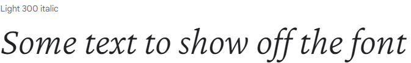
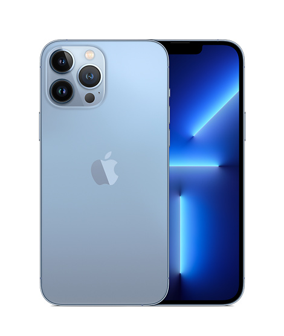
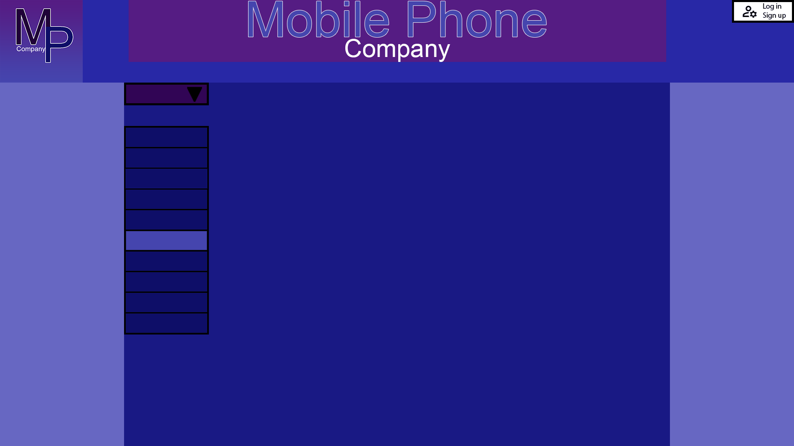

# Mobile Phone Company

## Stakeholders

* customers: 30-50 year old women
* Owners: People who own the company
* Developers: me

## specification

* Color
* Typography
* Design
* Layout
* Imagery
* Navigation

## interests 
* Customers

    * Product information 
        * At least the top 5 phones.
        * Images
        * A brief description about the phone.

    * Simple(easy to navigate)
        * (Specifications)

    * Quick loading

* Owners

    * Needs to look good
    * Professional
    * Generate business 
    * Cheap

* Developers
 
    * Well Documented 
    * Maintainable
    * Easy to test
    * Standards

# colour

i chose these colour scheme because of my Research i have seen a few websites use a type of blue colour and i think it works great with a website about phones and also i chose these colour because they are eye catching but not to bright. i also chose this because of colour blind people.

first colour pallet [Pallet 1](https://paletton.com/#uid=a3+4B1ksutJhCBymDvauynIzSiIku2kglOrHr1otAGfRM6at)

* primary colour

    * .color-primary-0 { color: #2828A6 }	
    * .color-primary-1 { color: #6767C2 }
    * .color-primary-2 { color: #4545AE }
    * .color-primary-3 { color: #191984 }
    * .color-primary-4 { color: #0E0E68 }

* complementary colour 

    * .color-complement-0 { color: #420E6D }	
    * .color-complement-1 { color: #6A3694 }
    * .color-complement-2 { color: #551C83 }
    * .color-complement-3 { color: #310555 }
    * .color-complement-4 { color: #200238 }

i will be using primary colour 0 for the navigation bar and i will be using the primary colour 2 for the phone list drop list. i will also be using the complementary colour 0 for links i have been on before and the links i am on right now.the text will be all black.

second colour pallet [Pallet 2](https://paletton.com/#uid=a3+3l1ktBohv57yuxgPtpxMq6KpkCczknzKZsTG6A6poBJjg)

* primary colour

    * .color-primary-0 { color: #e61b00 }
    * .color-primary-1 { color: #ff452c }
    * .color-primary-2 { color: #ff2407 }
    * .color-primary-3 { color: #b51500 }
    * .color-primary-4 { color: #840f00 }

*  complementary colour 

    * .color-complement-0 { color: #8a0070 }
    * .color-complement-1 { color: #dc00b2 }
    * .color-complement-2 { color: #ac008b }
    * .color-complement-3 { color: #6c0057 }
    * .color-complement-4 { color: #3f0033 }

for my second pallet i will use the same as the first one but i will make the dropdown box that your on complementary colour 2 so you know where you are.

# fonts

[font 1](https://fonts.google.com/specimen/Prompt?category=Serif,Sans+Serif#standard-styles) Prompt, Regular 400

font-family: 'Prompt', sans-serif;

i will use the first font for heading/subheadings mainly. i chose this font because is very similar to the regular one and a lot of websites use the regular font so i think it will work well with my website.

[font 2](https://fonts.google.com/specimen/Crimson+Pro?category=Serif,Sans+Serif)

font-family: 'Crimson Pro', serif;

i will use my second font as the main one for writing. the reason i used this font is because very similar to the regular but a bit more fancy so i am sure that this will work well as the main font.

# Navigation

H = Home page

L = login page

Numbered = phone pages

|   |  H |  L |   1 |   2 |  3 |   4 |  5 |   6 |  7 |   8 |  9 |   10|
|---| -- | --- | -- | --- | -- | --- | -- | --- | -- | --- | -- | --- |
| H | ✅ | ✅ | ✅ | ✅ | ✅ | ✅ | ✅ | ✅ | ✅ | ✅ | ✅ | ✅ |
| L | ✅ | ✅ | ✅ | ✅ | ✅ | ✅ | ✅ | ✅ | ✅ | ✅ | ✅ | ✅ |
| 1 | ✅ | ✅ | ✅ | ✅ | ✅ | ✅ | ✅ | ✅ | ✅ | ✅ | ✅ | ✅ |
| 2 | ✅ | ✅ | ✅ | ✅ | ✅ | ✅ | ✅ | ✅ | ✅ | ✅ | ✅ | ✅ |
| 3 | ✅ | ✅ | ✅ | ✅ | ✅ | ✅ | ✅ | ✅ | ✅ | ✅ | ✅ | ✅ |
| 4 | ✅ | ✅ | ✅ | ✅ | ✅ | ✅ | ✅ | ✅ | ✅ | ✅ | ✅ | ✅ |
| 5 | ✅ | ✅ | ✅ | ✅ | ✅ | ✅ | ✅ | ✅ | ✅ | ✅ | ✅ | ✅ |
| 6 | ✅ | ✅ | ✅ | ✅ | ✅ | ✅ | ✅ | ✅ | ✅ | ✅ | ✅ | ✅ |
| 7 | ✅ | ✅ | ✅ | ✅ | ✅ | ✅ | ✅ | ✅ | ✅ | ✅ | ✅ | ✅ |
| 8 | ✅ | ✅ | ✅ | ✅ | ✅ | ✅ | ✅ | ✅ | ✅ | ✅ | ✅ | ✅ |
| 9 | ✅ | ✅ | ✅ | ✅ | ✅ | ✅ | ✅ | ✅ | ✅ | ✅ | ✅ | ✅ |
| 10| ✅ | ✅ | ✅ | ✅ | ✅ | ✅ | ✅ | ✅ | ✅ | ✅ | ✅ | ✅ |

# assets

## phone

all the assets I used where not mine i got the images from Ebay and the videos where from youtube made by The Tech Chap and Tech Spurt.

### phone 1

Samsung Galaxy S21 Ultra

camera quality - 12MP 

storage - 256 GB 

screen resolution - 1440 x 3200 pixels 

battery life - 11 hours and 30 minutes 

£949.00

https://www.youtube.com/watch?v=_jra0B-3zno

### phone 2

iphone 13 pro max

 camera quality - 12MP 
 
storage - 128GB 

screen resolution - 2778 x 1284 pixels 

battery life - 26hrs 

£1049.00

https://www.youtube.com/watch?v=bcgvnyWlSgo&t=1s

### phone 3

OnePlus 9 Pro

camera quality - 48MP

storage - 256GB

screen resolution - 1,440 x 3,216 pixels 

battery life - 10 hours and 40 minutes 

£538.99

https://www.youtube.com/watch?v=3qlzwyCrev8&t=1s

### phone 4

huawei mate 40 pro

camera quality - 40MP 

storage - 256GB 

screen resolution - 1344 x 2772 pixels 

battery life - 15hrs 

£599.99

https://www.youtube.com/watch?v=nKIrVniyF2g&feature=emb_imp_woyt

### phone 5

Google Pixel 6

camera quality - 50MP 

storage - 128GB 

screen resolution - 2,400x1,080 pixels 

battery life - 20hrs 

£599.00

https://www.youtube.com/watch?v=bTU-5MzriHU

### phone 6

Xperia 5 III

camera quality - 12MP 

storage - 128GB 

screen resolution - 2,520 x 1,080 pixels

battery life - 12hrs and 30 minutes

£998.00

https://www.youtube.com/watch?v=6wduNxIQrLQ

# design

I did some research on some phone company's and with the information I have gathered from then I have made two layouts for my website both using different colour scheme. 
# layout 1

I have started by using the colour (color primary 2) and (color complement 2) for the logo, (color primary 2) for the text, (color complement 2) for the banner and then i used (color primary 0) for the nav bar, (color primary 1) for the ad part and (color primary 3) for the center box.I ended up scraping this layout and using the second one instead. 

## colour

With the research i did i have chosen a colour scheme to go with the first layout i have chosen this colour scheme because i have realized that a lot of phone company's make there web pages a type of blue colour. the blue i used is an eye caching colour and its also easy on colour blind people.

first colour scheme 

* primary colour 

    * .color-primary-0 { color: #2828A6 }	
    * .color-primary-1 { color: #6767C2 }
    * .color-primary-2 { color: #4545AE }
    * .color-primary-3 { color: #191984 }
    * .color-primary-4 { color: #0E0E68 }

* complementary colour 

    * .color-complement-0 { color: #420E6D }	
    * .color-complement-1 { color: #6A3694 }
    * .color-complement-2 { color: #551C83 }
    * .color-complement-3 { color: #310555 }
    * .color-complement-4 { color: #200238 }

# layout 2

I have started by using the colour (color primary 3) and (color complement 3) for the logo,and then i used (color primary 2) for the nav bar, (color complement 3)for the ad part and (color primary 3) for the center box.

## colour 

for my second layout i have chosen this colour scheme because these two colour work well together and its not to much, it also well for colour blind people and it makes the text stand out more.

* primary colour

    * .color-primary-0 { color: #e61b00 }
    * .color-primary-1 { color: #ff452c }
    * .color-primary-2 { color: #ff2407 }
    * .color-primary-3 { color: #b51500 }
    * .color-primary-4 { color: #840f00 }

*  complementary colour 

    * .color-complement-0 { color: #8a0070 }
    * .color-complement-1 { color: #dc00b2 }
    * .color-complement-2 { color: #ac008b }
    * .color-complement-3 { color: #6c0057 }
    * .color-complement-4 { color: #3f0033 }

When you click on the log in button it will come up with not implemented and i have not added that feature. both the page and the phone list will be scrollable, you will have to click image for it to send you to the phones about page.

# feedback

## Aiden
The scroll bar doesn't save after clicking on a phone.
This is a bit tedious to having to scroll all the way down expecting seamless transitions to and from phone.

The Text for each phone name & price is not very well laid out.
The price tag would benefit greatly from having it more attractive on it's own like different color and a bit bigger to emphasis.

The description is missing some info like a table with it's specifications which is a must have for users who are after the specs rather than looks.

The design is really nice and thought of, the scroll bar action is a nice idea and it seems you wanted seamless transition which would of been great to see. The colours are not matching the main page (red colour) where phones are very bright to see the details. Recommend using a darker contrast with white text colours.

Overall I quite like the design, if it had more time it would of been perfected.

## Adam

The scroll bar doesnt stay in the most recent place, it resets.
The text for each phone is kinda heard to read, maybe make it better
there is a lot of free space that you could use
I dont really like the colour scheme i think the red isnt really that good
overall the idea was good however i dont like the over exacution 

## Nojus    

the Phone details are bare minimum as well as being small, not 8 interlinked hyperlinks
the white background of the image makes it look low quality, in my opinion it'd look better if the white was removed to make the background match the container it's in.
like mentioned the phones need more detail.

## reply

For the scroll bar I cant find a way to make is stay in the same position i tried a bunch of different ways even using java script but it didn't work out. 

I have changed the colour of the back ground so it would match the colour of the image background.

I have changed the list to a table so the specs looks more organized.

# Test plan

1: I will test my website on two different browsers (opera gx and firefox).

2: I will see how my website looks when I resize the browser.

3: I will zoom in and out of my website and see what changes.

# Testing

1: I tested my website on firefox and opera gx and the only thing that happened was that some things like the content box moved a bit and and the phone list got a bit cut off.

2: Resizing the browser changes a lot the text box gets cut off the phone list gets cut. so you cant really see the last phone and it just not look good.

3: Zooming in and out off the page changes everything, so if you zoom in to much the text box and the phone list gets cut of and if you zoom out everything gets super small and spreads apart.

the reason everything breaks and moves is because I used pixel to size everything instead of using vh/vw which would fix a lot of problems with sizing.

# final 

I have added in a bunch of different phones from different company's with their prices and specifications, I talked about the phones battery life, camera quality, storage capacity and screen resolution, all the specifications alow the customer pick the best phone for the best phone price.

